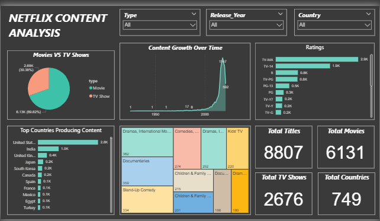

# Netflix-Analysis
Data analysis project exploring Netflix movies and TV shows using SQL and Power BI to uncover trends in content distribution, ratings, genres, and countries.

# 🎬 Netflix Content Analysis | SQL + Power BI Dashboard

## 📌 Project Overview

This project explores the **Netflix Movies and TV Shows dataset** to analyze content distribution, ratings, genre popularity, and global production patterns.

The project demonstrates how **SQL can be used for data exploration** and **Power BI can transform the insights into an interactive dashboard**.

The dashboard enables users to **analyze Netflix content trends dynamically using filters and visualizations.**

---

## 🎯 Project Objectives

- Analyze the **distribution of Movies vs TV Shows**
- Identify **top countries producing Netflix content**
- Study **content growth over time**
- Understand **rating distribution across titles**
- Explore **genre popularity**

---

## 🛠 Tech Stack

| Tool | Purpose |
|-----|--------|
| **SQL** | Data exploration & querying |
| **Power BI** | Dashboard creation |
| **Dataset** | Netflix titles dataset |

---

## 📊 Dashboard Features

The dashboard provides several insights using interactive visuals:

### 🎥 Movies vs TV Shows
Displays the proportion of **Movies and TV Shows available on Netflix**.

### 📈 Content Growth Over Time
Shows how Netflix’s content library has **expanded across years**.

### ⭐ Ratings Distribution
Analyzes the most common **content rating categories**.

### 🌍 Top Countries Producing Content
Highlights which countries contribute the **most Netflix titles**.

### 🎭 Genre Insights
Shows the most popular **content genres available on the platform**.

---

## 📊 Key Dashboard Metrics

| Metric | Value |
|------|------|
| Total Titles | **8807** |
| Total Movies | **6131** |
| Total TV Shows | **2676** |
| Total Countries | **749** |

---

## 🎛 Interactive Filters

The dashboard allows users to filter data by:

- **Content Type**
- **Release Year**
- **Country**

These filters make the analysis **fully interactive and user-driven.**

---

## 📸 Dashboard Preview

---

## 💡 Insights Gained

- Movies dominate the Netflix content library.
- The **United States produces the most content** on the platform.
- Netflix experienced **rapid content growth after 2015**.
- **Drama and international content** are among the most common genres.

---
**Nidhi Dhiliwal**
